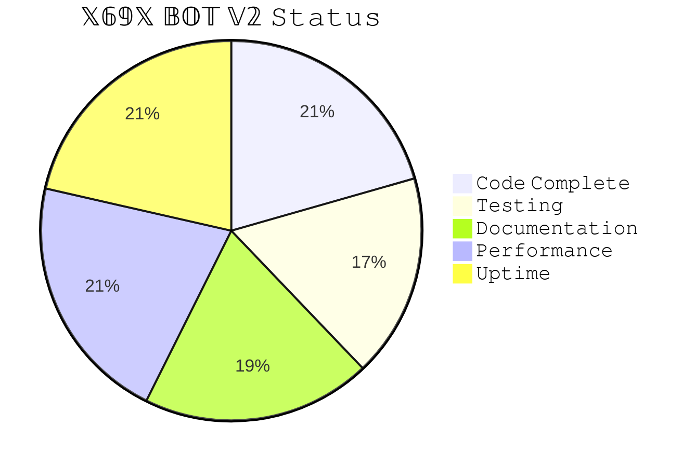

<div align="center">


</div>

🤖 X69X BOT V2 

[](https://git.io/typing-svg)
[](https://git.io/typing-svg)
[](https://git.io/typing-svg)

<p align="center">
  <a href="https://github.com/ncazad/Azadx69x">
    
  </a>
  <a href="https://github.com/ncazad/Azadx69x/forks">
    
  </a>
  <a href="https://github.com/ncazad/Azadx69x">
    
  </a>
  <a href="https://profile-counter.glitch.me/ncazad/count.svg">
     
  </a>
</p>
<p align="center">
  
</p>

<hr style="border: 2px solid #FF00FF; border-radius: 5px;">

<div align="center">

<a href="https://github.com/ncazad/Azadx69x/fork">
  
</a>

</div>
---

🛠️ 𝚀𝚄𝙸𝙲𝙺 𝚂𝚃𝙰𝚁𝚃

```bash
# 🐙 𝙲𝚕𝚘𝚗𝚎 𝚝𝚑𝚎 𝚛𝚎𝚙𝚘
git clone https://github.com/ncazad/Azadx69x.git

# 📁 𝙴𝚗𝚝𝚎𝚛 𝚍𝚒𝚛𝚎𝚌𝚝𝚘𝚛𝚢
cd Azadx69x

# 📦 𝙸𝚗𝚜𝚝𝚊𝚕𝚕 𝚍𝚎𝚙𝚎𝚗𝚍𝚎𝚗𝚌𝚒𝚎𝚜
npm install

# ⚙️ 𝙲𝚘𝚗𝚏𝚒𝚐𝚞𝚛𝚎 𝚋𝚘𝚝
cp config.example.json config.json
# ✏️ 𝙴𝚍𝚒𝚝 𝚌𝚘𝚗𝚏𝚒𝚐.𝚓𝚜𝚘𝚗 𝚠𝚒𝚝𝚑 𝚢𝚘𝚞𝚛 𝚍𝚎𝚝𝚊𝚒𝚕𝚜

# 🚀 𝚂𝚝𝚊𝚛𝚝 𝚝𝚑𝚎 𝚋𝚘𝚝
npm start

# 🔧 𝙳𝚎𝚟𝚎𝚕𝚘𝚙𝚖𝚎𝚗𝚝 𝚖𝚘𝚍𝚎
npm run dev
```

---

📋 𝙴𝚂𝚂𝙴𝙽𝚃𝙸𝙰𝙻 𝙲𝙾𝙼𝙼𝙰𝙽𝙳𝚂

𝙸𝙲𝙾𝙽 𝙲𝙾𝙼𝙼𝙰𝙽𝙳 𝙳𝙴𝚂𝙲𝚁𝙸𝙿𝚃𝙸𝙾𝙽 𝙰𝙲𝙲𝙴𝚂𝚂
🤖 !x69x 𝚂𝚑𝚘𝚠 𝚋𝚘𝚝 𝚒𝚗𝚏𝚘 𝙰𝚕𝚕
🎮 !menu 𝚂𝚑𝚘𝚠 𝚊𝚕𝚕 𝚌𝚘𝚖𝚖𝚊𝚗𝚍𝚜 𝙰𝚕𝚕
👑 !admin 𝙰𝚍𝚖𝚒𝚗 𝚙𝚊𝚗𝚎𝚕 𝙰𝚍𝚖𝚒𝚗
⚡ !speed 𝚂𝚙𝚎𝚎𝚍 𝚝𝚎𝚜𝚝 𝙰𝚕𝚕
🎯 !azad 𝙳𝚎𝚟𝚎𝚕𝚘𝚙𝚎𝚛 𝚒𝚗𝚏𝚘 𝙰𝚕𝚕
🔧 !prefix 𝙲𝚑𝚊𝚗𝚐𝚎 𝚙𝚛𝚎𝚏𝚒𝚡 𝙰𝚍𝚖𝚒𝚗
💎 !premium 𝙿𝚛𝚎𝚖𝚒𝚞𝚖 𝚏𝚎𝚊𝚝𝚞𝚛𝚎𝚜 𝙿𝚛𝚎𝚖𝚒𝚞𝚖
🎨 !theme 𝚃𝚑𝚎𝚖𝚎 𝚜𝚎𝚝𝚝𝚒𝚗𝚐𝚜 𝙰𝚕𝚕
📊 !stats 𝙱𝚘𝚝 𝚜𝚝𝚊𝚝𝚒𝚜𝚝𝚒𝚌𝚜 𝙰𝚕𝚕
🛠️ !update 𝚄𝚙𝚍𝚊𝚝𝚎 𝚋𝚘𝚝 𝙾𝚠𝚗𝚎𝚛

---

🎨 𝚇𝟼𝟿𝚇 𝙴𝚇𝙲𝙻𝚄𝚂𝙸𝚅𝙴 𝙲𝙾𝙼𝙼𝙰𝙽𝙳𝚂

🚀 𝙽𝚎𝚠 𝙲𝚘𝚖𝚖𝚊𝚗𝚍𝚜:

```bash
!x69x help      # 𝚂𝚑𝚘𝚠 𝚑𝚎𝚕𝚙 𝚖𝚎𝚗𝚞
!x69x info      # 𝙱𝚘𝚝 𝚒𝚗𝚏𝚘𝚛𝚖𝚊𝚝𝚒𝚘𝚗
!x69x version   # 𝚂𝚑𝚘𝚠 𝚟𝚎𝚛𝚜𝚒𝚘𝚗
!x69x ping      # 𝙲𝚑𝚎𝚌𝚔 𝚙𝚒𝚗𝚐
!x69x credits   # 𝙳𝚎𝚟𝚎𝚕𝚘𝚙𝚎𝚛 𝚌𝚛𝚎𝚍𝚒𝚝𝚜
!azad stats     # 𝙳𝚎𝚟𝚎𝚕𝚘𝚙𝚎𝚛 𝚜𝚝𝚊𝚝𝚜
```

⚡ 𝙵𝚊𝚜𝚝 𝙵𝚎𝚊𝚝𝚞𝚛𝚎𝚜:

· 🔥 𝚄𝚕𝚝𝚛𝚊 𝚏𝚊𝚜𝚝 𝚛𝚎𝚜𝚙𝚘𝚗𝚜𝚎
· 🎯 𝚂𝚖𝚊𝚛𝚝 𝚌𝚊𝚌𝚑𝚒𝚗𝚐
· 📡 𝚁𝚎𝚊𝚕-𝚝𝚒𝚖𝚎 𝚞𝚙𝚍𝚊𝚝𝚎𝚜
· 🛡️ 𝙰𝚍𝚟𝚊𝚗𝚌𝚎𝚍 𝚜𝚎𝚌𝚞𝚛𝚒𝚝𝚢
· 📱 𝙼𝚞𝚕𝚝𝚒-𝚍𝚎𝚟𝚒𝚌𝚎 𝚜𝚞𝚙𝚙𝚘𝚛𝚝
· 🔔 𝙽𝚘𝚝𝚒𝚏𝚒𝚌𝚊𝚝𝚒𝚘𝚗 𝚜𝚢𝚜𝚝𝚎𝚖

---

🎪 𝚂𝚄𝙿𝙿𝙾𝚁𝚃 & 𝙲𝙾𝙼𝙼𝚄𝙽𝙸𝚃𝚈

<div align="center">

<a href="https://github.com/ncazad">

</a>

<a href="https://t.me/cyber_bot01">

</a>

<a href="https://youtube.com/@cyberbotcommunity?si=7wqJsdLBRMvWkWOU">

</a>

</div>

---

📖 𝙲𝚁𝙴𝙳𝙸𝚃𝚂

🏆 𝙾𝚛𝚒𝚐𝚒𝚗𝚊𝚕 𝙲𝚛𝚎𝚊𝚝𝚘𝚛𝚜:

· 𝙲𝚈𝙱𝙴𝚁-𝚄𝙻𝙻𝙰𝚂𝙷 - 𝙲𝚈𝙱𝙴𝚁-𝙶𝙾𝙰𝚃-𝙱𝙾𝚃
· 𝚗𝚝𝚔𝚑𝚊𝚗𝚐𝟶𝟹 - 𝙶𝚘𝚊𝚝-𝙱𝚘𝚝-𝚟𝟸

👑 𝚇𝟼𝟿𝚇 𝚃𝙴𝙰𝙼:

𝚁𝙾𝙻𝙴 𝙼𝙴𝙼𝙱𝙴𝚁 𝙴𝙼𝙾𝙹𝙸
𝙻𝚎𝚊𝚍 𝙳𝚎𝚟 𝙰𝚣𝚊𝚍𝚇𝟼𝟿𝚇 👨‍💻
𝙵𝚘𝚛𝚔 𝙾𝚠𝚗𝚎𝚛 𝚗𝚌𝚊𝚣𝚊𝚍 🐱
𝙱𝚊𝚜𝚎 𝙲𝚘𝚍𝚎 𝙲𝚢𝚋𝚎𝚛-𝚄𝚕𝚕𝚊𝚜𝚑 🔧
𝚃𝚎𝚜𝚝𝚎𝚛 𝚇𝟼𝟿𝚇 𝚃𝚎𝚊𝚖 🧪
𝚂𝚞𝚙𝚙𝚘𝚛𝚝 𝙲𝚘𝚖𝚖𝚞𝚗𝚒𝚝𝚢 🤝

---

📜 𝙻𝙸𝙲𝙴𝙽𝚂𝙴

```text
✨ 𝕏𝟞𝟡𝕏 𝔹𝕆𝕋 𝕍𝟚 ✨
© 2024 𝙰𝚣𝚊𝚍𝚇𝟼𝟿𝚇 | 𝙵𝚘𝚛𝚔𝚎𝚍 𝚋𝚢 𝚗𝚌𝚊𝚣𝚊𝚍
𝙼𝙸𝚃 𝙻𝚒𝚌𝚎𝚗𝚜𝚎

🔗 𝙵𝚘𝚛𝚔 𝚁𝚎𝚙𝚘𝚜𝚒𝚝𝚘𝚛𝚢: https://github.com/ncazad/Azadx69x
🔗 𝙾𝚛𝚒𝚐𝚒𝚗𝚊𝚕 𝚁𝚎𝚙𝚘: https://github.com/cyber-ullash/CYBER-GOAT-BOT

𝚃𝚑𝚒𝚜 𝚙𝚛𝚘𝚓𝚎𝚌𝚝 𝚒𝚜 𝚏𝚛𝚎𝚎 𝚝𝚘 𝚞𝚜𝚎, 𝚖𝚘𝚍𝚒𝚏𝚢, 𝚊𝚗𝚍 𝚍𝚒𝚜𝚝𝚛𝚒𝚋𝚞𝚝𝚎.
𝙿𝚕𝚎𝚊𝚜𝚎 𝚖𝚊𝚒𝚗𝚝𝚊𝚒𝚗 𝚌𝚛𝚎𝚍𝚒𝚝𝚜 𝚝𝚘 𝚘𝚛𝚒𝚐𝚒𝚗𝚊𝚕 𝚊𝚞𝚝𝚑𝚘𝚛𝚜.
```

---

🌟 𝚂𝚃𝙰𝚁 𝙷𝙸𝚂𝚃𝙾𝚁𝚈

https://api.star-history.com/svg?repos=ncazad/Azadx69x&type=Date

---

🎯 𝚂𝚄𝙿𝙿𝙾𝚁𝚃 𝚃𝙷𝙴 𝙿𝚁𝙾𝙹𝙴𝙲𝚃

<div align="center">

<a href="https://github.com/ncazad/Azadx69x/stargazers">

</a>

<a href="https://github.com/ncazad/Azadx69x/fork">

</a>

<a href="https://github.com/ncazad/Azadx69x/issues">

</a>

</div>

---

📊 𝙿𝚁𝙾𝙹𝙴𝙲𝚃 𝚂𝚃𝙰𝚃𝚄𝚂

<div align="center">



</div>

---

🚨 𝙳𝙸𝚂𝙲𝙻𝙰𝙸𝙼𝙴𝚁

⚠️ 𝚃𝙷𝙸𝚂 𝙱𝙾𝚃 𝙸𝚂 𝙵𝙾𝚁 𝙴𝙳𝚄𝙲𝙰𝚃𝙸𝙾𝙽𝙰𝙻 𝙿𝚄𝚁𝙿𝙾𝚂𝙴𝚂 𝙾𝙽𝙻𝚈!

📵 𝙳𝚘𝚗'𝚝 𝚞𝚜𝚎 𝚏𝚘𝚛 𝚜𝚙𝚊𝚖𝚖𝚒𝚗𝚐
🚫 𝙳𝚘𝚗'𝚝 𝚟𝚒𝚘𝚕𝚊𝚝𝚎 𝚃𝙾𝚂
🔒 𝚄𝚜𝚎 𝚊𝚝 𝚢𝚘𝚞𝚛 𝚘𝚠𝚗 𝚛𝚒𝚜𝚔
👮 𝙳𝚎𝚟𝚎𝚕𝚘𝚙𝚎𝚛𝚜 𝚗𝚘𝚝 𝚛𝚎𝚜𝚙𝚘𝚗𝚜𝚒𝚋𝚕𝚎 𝚏𝚘𝚛 𝚖𝚒𝚜𝚞𝚜𝚎
⚖️ 𝚁𝚎𝚜𝚙𝚎𝚌𝚝 𝙵𝚊𝚌𝚎𝚋𝚘𝚘𝚔'𝚜 𝚃𝚎𝚛𝚖𝚜 𝚘𝚏 𝚂𝚎𝚛𝚟𝚒𝚌𝚎

---

<div align="center">

🎊 𝚃𝙷𝙰𝙽𝙺 𝚈𝙾𝚄! 🎊

✨ 𝙼𝙰𝙳𝙴 𝚆𝙸𝚃𝙷 ❤️ 𝙱𝚈 𝙰𝚉𝙰𝙳𝚇𝟼𝟿𝚇 ✨

🐱 𝙵𝙾𝚁𝙺𝙴𝙳 𝙱𝚈 𝙽𝙲𝙰𝚉𝙰𝙳 🐱

🔗 𝙵𝚘𝚛𝚔 𝚁𝚎𝚙𝚘: https://github.com/ncazad/Azadx69x

📅 𝚁𝚎𝚕𝚎𝚊𝚜𝚎 𝙳𝚊𝚝𝚎: 𝙽𝚘𝚟𝚎𝚖𝚋𝚎𝚛 𝟸𝟶𝟸𝟺

https://img.shields.io/badge/👤+𝙵𝙾𝙻𝙻𝙾𝚆+𝙼𝙴-FF69B4?style=for-the-badge&logo=github
https://img.shields.io/badge/💝+𝚂𝚄𝙿𝙿𝙾𝚁𝚃-00FFFF?style=for-the-badge

🎯 𝙷𝙰𝙿𝙿𝚈 𝙱𝙾𝚃𝚃𝙸𝙽𝙶! 🤖💫

</div>

---

🔗 𝚀𝚄𝙸𝙲𝙺 𝙻𝙸𝙽𝙺𝚂

· 📚 𝙳𝚘𝚌𝚞𝚖𝚎𝚗𝚝𝚊𝚝𝚒𝚘𝚗
· 🐞 𝙸𝚜𝚜𝚞𝚎𝚜
· 💬 𝙳𝚒𝚜𝚌𝚞𝚜𝚜𝚒𝚘𝚗𝚜
· 📦 𝚁𝚎𝚕𝚎𝚊𝚜𝚎𝚜
· 🔗 𝙾𝚛𝚒𝚐𝚒𝚗𝚊𝚕 𝚁𝚎𝚙𝚘

---

<div align="center">

⭐ 𝙳𝙾𝙽'𝚃 𝙵𝙾𝚁𝙶𝙴𝚃 𝚃𝙾 𝚂𝚃𝙰𝚁 𝚃𝙷𝙴 𝚁𝙴𝙿𝙾! ⭐

🎨 𝙲𝚘𝚕𝚘𝚛𝚏𝚞𝚕, 𝙴𝚖𝚘𝚓𝚒-𝚏𝚒𝚕𝚕𝚎𝚍, 𝚊𝚗𝚍 𝚁𝙴𝙰𝙳𝚈 𝚃𝙾 𝚄𝚂𝙴! 🚀

🐱 𝙵𝚘𝚛𝚔𝚎𝚍 𝚏𝚛𝚘𝚖 𝙲𝚈𝙱𝙴𝚁-𝙶𝙾𝙰𝚃-𝙱𝙾𝚃 & 𝚄𝚙𝚍𝚊𝚝𝚎𝚍 𝚠𝚒𝚝𝚑 𝚇𝟼𝟿𝚇 𝙵𝚎𝚊𝚝𝚞𝚛𝚎𝚜! 🔥

</div>
